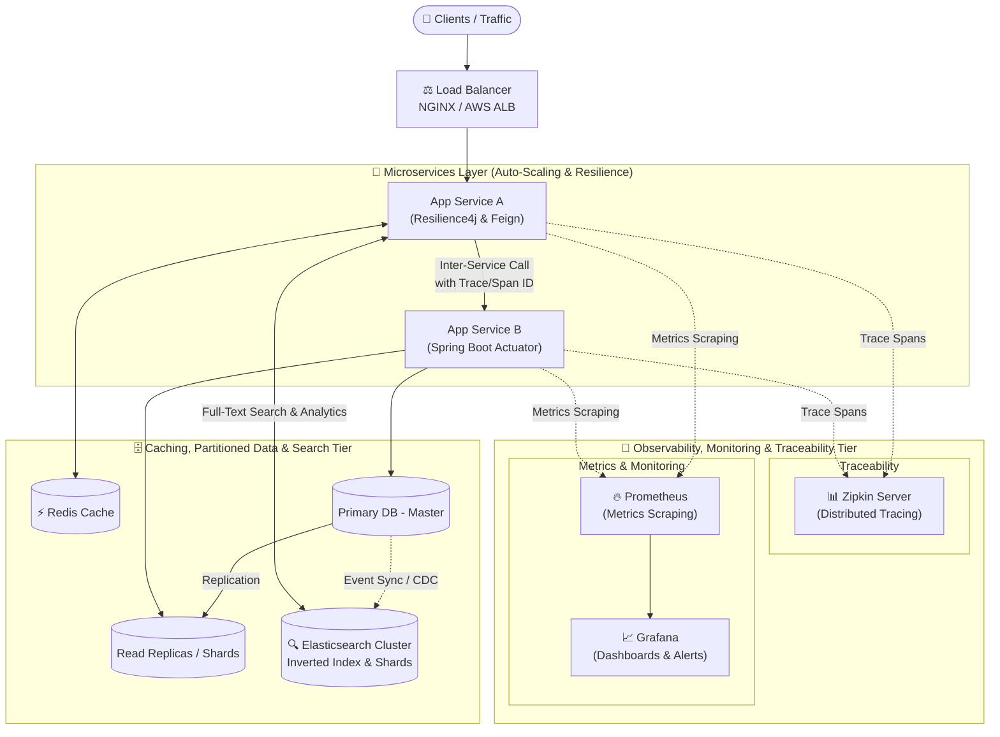
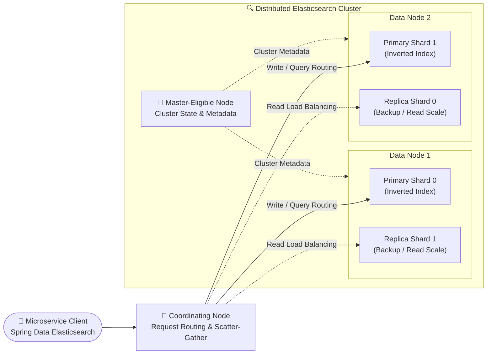

# Hi 👋, I'm Hari Prasanth

  
  

<!-- Dynamic Animated Skill Icons Bar -->

  

---

### 👨‍💻 About Me

- 💼 **Role:** Associate Software Engineer
- ☕ **Core Expertise:** Enterprise backend systems with **Java (8 / 17 / 21)**, **Spring Boot (including Spring Boot 4)**, and **Microservices Architecture**.
- 📐 **System Design & Scalability:** Deep understanding of **High-Level Design (HLD)** and **Low-Level Design (LLD)**. Experienced with **Load Balancing** (NGINX, AWS ALB), **Horizontal & Vertical Scalability**, distributed **Caching** strategies (Redis), **Fault Tolerance Patterns** (Resilience4j Circuit Breaker, Rate Limiting, Bulkhead), and advanced **Database Design & Partitioning** (Sharding, Master-Slave Replication, Read Replicas).
- 🔍 **Distributed Search Engine (Elasticsearch):** Designing and implementing enterprise search with **Elasticsearch** — cluster architecture, primary/replica shards, inverted indexing, tokenizers/analyzers, and Spring Data Elasticsearch integration for sub-second full-text retrieval.
- 🔭 **Observability, Monitoring & Traceability:** Production-ready metrics and telemetry instrumentation with **Spring Boot Actuator** and **Micrometer**. Scraping and visualizing system metrics using **Prometheus** and **Grafana**, alongside distributed request tracing and latency analysis across microservices using **Zipkin**.
- 🧩 **Design Patterns:** Extensive hands-on with Gang of Four (GoF) patterns (*Creational, Structural, Behavioral*) and Distributed Systems patterns (*Saga, CQRS, Circuit Breaker, Outbox*).
- 🤖 **Agentic AI & MCP Work:** Building and integrating **Model Context Protocol (MCP)** tools and servers, enabling AI agents and LLMs to interact with enterprise databases, APIs, and microservices.
- ☁️ **Cloud & Containers:** Designing, deploying, and containerizing services with **AWS** & **Docker**.
- ⚙️ **Distributed Systems & Messaging:** Event-driven architecture with **Apache Kafka** & **RabbitMQ**, declarative inter-service REST communication with **Spring Cloud (OpenFeign)**, and **Saga Pattern (Choreography)**.
- ⚡ **Caching, Relational & Time-Series DBs:** High-performance caching with **Redis**, time-series data with **InfluxDB**, and relational/document persistence with **PostgreSQL**, MySQL, MongoDB, and Oracle.
- 🛡️ **Security & Cross-Cutting Concerns:** Aspect-Oriented Programming with **Spring AOP**, plus fine-grained authentication and authorization with **Spring Security** (JWT & Role/Permission control).
- 🔌 **Integration & Testing:** Robust **RESTful API Integration**, command-line HTTP testing with **cURL**, API automation with **Postman**, SMTP & email testing with **Mailpit**, payment gateways (Razorpay), and AI models (Hugging Face).
- 🧠 **Problem Solving:** Actively practicing **Data Structures & Algorithms (DSA)** in Java.

---

### 📐 System Architecture, Scalability & Observability

---

### 🔍 Elasticsearch Distributed Cluster Architecture

#### **Architecture, Scalability & Search Principles**

| Dimension | Strategy & Patterns | Tech & Implementations |
| :--- | :--- | :--- |
| **🔎 Distributed Search Engine** | Inverted Index, Sharding (Primary & Replica), Query-then-Fetch, Tokenization & Analyzers | Elasticsearch, Spring Data Elasticsearch |
| **📈 Scalability** | Horizontal & Vertical Scaling, Stateless Services, Asynchronous Pipelines | Docker, AWS, Kafka, Microservices |
| **⚖️ Load Balancing** | Round Robin, Least Connections, IP Hash, Layer 4 & Layer 7 Routing | NGINX, AWS ALB / ELB |
| **⚡ Caching Strategy** | Cache-Aside (Lazy Loading), Write-Through, Write-Back, TTL, LRU Eviction | Redis, Distributed Cache |
| **🛡️ Fault Tolerance** | Circuit Breaker, Bulkhead Isolation, Rate Limiting, Exponential Backoff, Fallback | Resilience4j, Spring Cloud |
| **🗄️ Database Design & Partitioning** | Horizontal & Vertical Sharding, Range/Hash Partitioning, Master-Slave Replication, Read Replicas, B-Tree Indexing | PostgreSQL, MySQL, InfluxDB |
| **📊 Monitoring & Metrics** | Real-time metric scraping, SLA/SLO tracking, threshold alerting, custom dashboards | Prometheus, Grafana, Spring Boot Actuator |
| **🔍 Traceability** | Distributed request tracing, Trace ID & Span ID propagation, latency bottleneck diagnosis | Zipkin, Micrometer Tracing |

  
  
  
  
  
  
  
  

---

### 🛠️ Tech Stack & Skills

#### **Architecture, System Design & Design Patterns**

  
  
  
  
  
  

- 🏗️ **Creational Patterns:** Singleton, Factory Method, Abstract Factory, Builder, Prototype
- 🧩 **Structural Patterns:** Adapter, Decorator, Facade, Proxy, Composite
- 🔄 **Behavioral Patterns:** Observer, Strategy, Chain of Responsibility, Command, Template Method, State
- 🌐 **Enterprise & Distributed Patterns:** Saga Pattern (Choreography & Orchestration), CQRS, Circuit Breaker, Outbox Pattern, Event Sourcing

---

#### **Observability, Monitoring & Traceability**

  
  &nbsp;&nbsp;
  
  &nbsp;&nbsp;
  

  
  
  
  
  

---

#### **Languages**

  
  &nbsp;&nbsp;
  

  
  

#### **Backend & Microservices Ecosystem**

  
  &nbsp;&nbsp;
  
  &nbsp;&nbsp;
  

  
  
  
  
  
  
  
  
  

#### **Messaging, Event Streaming & AI Agent Protocols**

  
  &nbsp;&nbsp;
  
  &nbsp;&nbsp;
  

  
  
  
  

#### **Databases, Search Engines, Caching & Partitioning**

  
  &nbsp;&nbsp;
  
  &nbsp;&nbsp;
  
  &nbsp;&nbsp;
  
  &nbsp;&nbsp;
  
  &nbsp;&nbsp;
  
  &nbsp;&nbsp;
  

  
  
  
  
  
  
  

#### **Cloud, DevOps, Tools & Infrastructure**

  
  &nbsp;&nbsp;
  
  &nbsp;&nbsp;
  
  &nbsp;&nbsp;
  
  &nbsp;&nbsp;
  
  &nbsp;&nbsp;
  
  &nbsp;&nbsp;
  
  &nbsp;&nbsp;
  
  &nbsp;&nbsp;
  
  &nbsp;&nbsp;
  

  
  
  
  
  
  
  
  
  
  
  

#### **IDEs & Environment**

  
  &nbsp;&nbsp;
  
  &nbsp;&nbsp;
  

  
  
  

---

### 🌟 Featured Highlights & Projects

- 🔄 **[Saga Pattern Choreography](https://github.com/hariprasanth-jcode/saga_pattern_choregraphy)** — Distributed transaction management across microservices using Spring Boot.
- ⚡ **[Spring Boot & Apache Kafka](https://github.com/hariprasanth-jcode/spring_boot_kafka)** — Event-driven architecture with asynchronous messaging and producer-consumer pipelines.
- 🛡️ **[Spring Security Role & Permissions](https://github.com/hariprasanth-jcode/spring_security_role_and_permission)** — Complete authentication and fine-grained authorization with JWT.
- 🤖 **[Spring Boot + Hugging Face AI](https://github.com/hariprasanth-jcode/spring_boot_hugging_face_ai)** — Integrating state-of-the-art AI models into Spring Boot backend services.
- 🐳 **[Dockerized Employee Service](https://github.com/hariprasanth-jcode/employee-service-docker)** — Containerized Spring Boot microservices ready for cloud deployment.
- 💳 **[Spring Boot Razorpay Integration](https://github.com/hariprasanth-jcode/springboot-razor-pay)** — End-to-end payment gateway processing.
